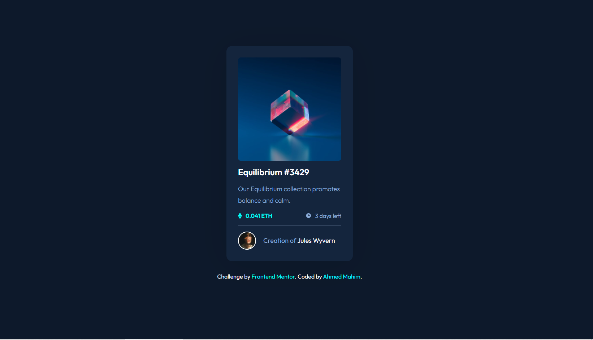

# Frontend Mentor - NFT preview card component solution

This is a solution to the [NFT preview card component challenge on Frontend Mentor](https://www.frontendmentor.io/challenges/nft-preview-card-component-SbdUL_w0U). Frontend Mentor challenges help you improve your coding skills by building realistic projects. 


## Overview

### The challenge

Users should be able to:

- View the optimal layout depending on their device's screen size
- See hover states for interactive elements

### Screenshot



### Links

- Solution URL: [Add solution URL here](https://github.com/AhmedMahim/NFT-preview-card-Front-end-Mentor)
- Live Site URL: [Add live site URL here](https://nft-preview-front-end-mentor.netlify.app)

## My process

### Built with

- Semantic HTML5 markup
- CSS custom properties
- Flexbox
### What I learned

```html
<hr>
```
```css
html {
  --white: #fff;
}
```
## Author

- Website - [Add your name here](https://github.com/AhmedMahim)
- Frontend Mentor - [@yourusername](https://www.frontendmentor.io/profile/AhmedMahim)
- Twitter - [@yourusername](https://www.twitter.com/Ahmedmahim26)

